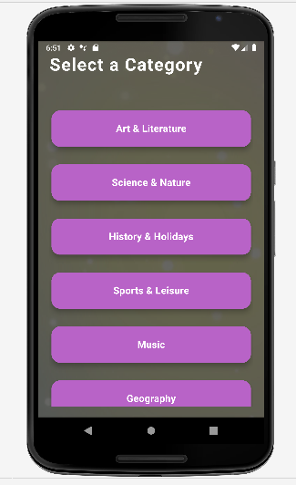
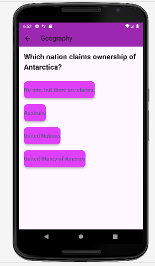
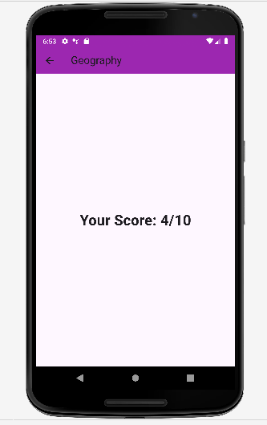

# Flutter Quiz App

A simple Flutter-based quiz app that provides a fun way to learn by taking trivia quizzes. The app fetches random questions from a public API based on categories like Science, Literature, Music, and more. Players can select a category and answer 10 questions, then get their score at the end.

## Features

- **Categories**: Choose from multiple categories like Art & Literature, Science, Music, History, Sports, and more.
- **Randomized Questions**: Questions are fetched dynamically from the Open Trivia Database API.
- **Score Display**: Shows the score out of 10 after completing the quiz.

## Preview

 
 
 
 

